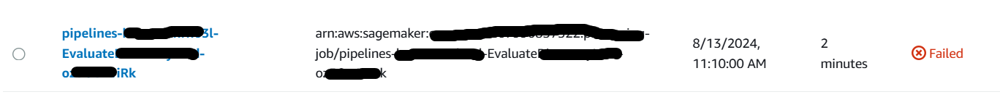

# Sagemaker Pipeline Troubleshooter

## Overview

The **S3 Tarball Manager** is a Python library designed to automate the process of downloading, modifying, and uploading tarballs stored in Amazon S3. Efficiently troubleshooting pipeline runs in AWS SageMaker is crucial for maintaining a smooth machine learning workflow. Often, pipeline runs may fail at later stages after successfully completing the initial steps. Resubmitting the job from the beginning in such cases can be time-consuming and inefficient. To address this, I developed **S3 Tarball Manager** that allows you to modify the code and resume the pipeline from the point of failure, eliminating the need to restart the entire pipeline run.

## Features

- **Download Tarball**: Fetch a tarball from an S3 bucket using its URI.
- **Extract Tarball**: Unpack the tarball to a local directory.
- **Modify Script**: Make text replacements, insert lines, and delete lines in a specified script file within the tarball.
- **Repackage Tarball**: Compress the modified files back into a tarball.
- **Upload Tarball**: Upload the updated tarball back to the S3 bucket.
- **Cleanup**: Remove local files and directories used during the process to keep the environment clean.

## Installation

You can install the s3-tarball-manager package via pip:

    ```sh
    pip install s3-tarball-manager
    ```

### Configuring AWS Account

To use this library, you need to configure your AWS account:

1. **Install AWS CLI**: Follow the instructions to install the AWS CLI from the [AWS CLI Installation Guide](https://docs.aws.amazon.com/cli/latest/userguide/install-cliv2.html).

2. **Configure AWS CLI**: Run the following command and follow the prompts to enter your AWS access key, secret key, region, and output format.

    ```sh
    aws configure
    ```

    This will set up your credentials and default region in the `~/.aws/credentials` and `~/.aws/config` files.

## Usage

To use the library, create a Python script that utilizes the `S3TarballManager` class. Below is an example script:

### Example Usage

### Using the Package in a Python Script
Here’s an example of how to use the s3-tarball-manager in a Python script:


```python
from s3_tarball_manager.manager import S3TarballManager

# Define the S3 URI, script name, modifications, line insertions, and deletions
s3_uri = 's3://your-bucket/your-tarball'
script_name = 'preprocess.py'
modifications = {
    'original_text': 'new_text'
}
line_insertions = {
    188: '# this section explains a feature engineering'
}
line_deletions = [200]

# Create an instance of S3TarballManager
manager = S3TarballManager(s3_uri)

# Process the tarball
manager.process_tarball(script_name, modifications, line_insertions, line_deletions)
```

### Command Line Arguments
--s3-uri: The S3 URI of the tarball.
--script: The name of the script to modify inside the tarball.
--modifications: Text modifications in the format original_text=new_text.
--insertions: Line insertions in the format line_number=new_line.
--deletions: Line numbers to delete.


### Example Command


```sh
python -m s3_tarball_manager.manager --s3-uri s3://my-bucket/my-tarball.tar.gz --script preprocess.py --modifications "original_text=new_text" --insertions "188=# this section explains a feature engineering" --deletions 200
```


### How to troubleshoot a Sagemaker pipeline

If your SageMaker pipeline fails after submitting the job from either your SageMaker environment or VS Code, follow these steps to troubleshoot:

## 1. Navigate to the Failed Job
- Go to your AWS account, then navigate to **Amazon SageMaker > Processing Jobs**.
- Locate the failed job. In this example, we're assuming the pipeline failed at the "Evaluate" step. Note that both "Preprocessing" and "Evaluate" steps can be found under Processing Jobs.




## 2. Retrieve the S3 URI
- Inside the failed job, find the S3 URI with the extension `.sourcedir.tar.gz`.
- Copy this link.


## 3. Update the Job Configuration
- Paste the copied link into the `--s3-uri` parameter and make any necessary changes to your job configuration.

## 4. Access the Pipeline in SageMaker Studio
- Go to **Amazon SageMaker Studio > Pipelines**.


## 5. Retry the Failed Pipeline
- Find the pipeline that failed.
- After making the required changes with S3TarballManager, click on "Retry" to resubmit the pipeline.


This will restart the pipeline where it left off.